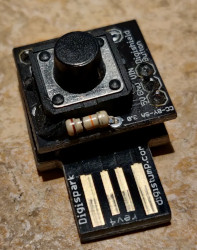
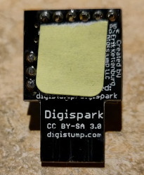

# Macro Button

This project uses the DigiSpark USB Development Board v4, the DigiStump Button board, and a few soldered headers to make a keyboard macro input device.

The device is capable of sending one or more pre-programmed strings in response to a single character of Morse Code input.  This input method allows for a single-key macro keyboard, with a modicum of security by obscurity through the use of a Morse code letter.

# Hardware
DigiStump's DigiSpark was the result of a Kickstarter project, and has undergone a few revisions, and the company has branched into other lines of hardware. This project uses an early DigiSpark, which is a small Atmel ATTINY85 supported by the library written by the kind folks at DigiSpark.com.

 

# Issues I encountered
I encountered the following issues developing this sketch:

## Hardware Issues
The DigiSpark board I have is marked V4, and it has the LED on Pin 0. Unfortunately, the original DigiSpark (no-rev marker, and some other numbers as well) have the LED on pin 1. I mistook the board configuration when soldering the button in place and tied it to Pin 0, the LED pin. That means that the LED is on if the button is pressed, but software controllable at other times. In order to multiplex and save my hardware config, I multiplexed the pin by using pinMode before each LED and each button operation.

The DigiKeyboard.delay function appears to run twice as quickly as the spec, so perhaps I need to set the OSC CAL register.

## Readiness issue
The DigiSpark boot loader has a 5-second timeout before it starts running application code. It's clear that this is the case because you can program it only in the first 5 seconds after being plugged in, but it's still sometimes confusing, especially if you're trying to debug timing issues. So, I added a moderate LED ON time at the start of setup(), followed by a rapid set of blinks at the end of setup. This makes it easier to judge whether the device is up and running. 

## Debouncing Issues
Device general reliability was low, and after a number of other causes (boot time, hardware pin conflicts, timing issues, etc.) were resolved. At this point I had good LED and "print" statement feedback, and found that the button was hard to trigger and very bouncy when pressed hard enough to trigger. I cleaned it with electronics cleaner and found it much more reliable, though still bouncy.

## Clones and Pins
Some clones of, for example on Aliexpress, use Pin 5 as reset, so you need to prepare the switch board by cutting the SJ1 jumper and soldering SJ2, or vice versa.

## Failure to boot
About 1/3 of the devices fail to boot once the switch board is attached, even with all pins cut from the 6-pin header except the input pin. More study is needed.

# References
- DigiStump Hardware http://digistump.com/
- DigiSpark USB Development Board http://digistump.com/products/1
- DigiSpark USB Development Board Arduino IDE "Board" link http://digistump.com/package_digistump_index.json
- Arduino Keyboard library Tutorial example http://www.arduino.cc/en/Tutorial/KeyboardMessage
- DigiSpark Button Tutorial example https://digistump.com/wiki/digispark/tutorials/button
- Debouncing Arduino tutorial https://www.arduino.cc/en/Tutorial/BuiltInExamples/Debounce
- Debouncing from Adafruit https://learn.adafruit.com/make-it-switch/debouncing
